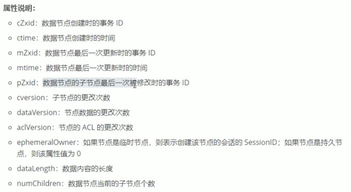

## 待办
- 转换service层逻辑
- 完成前端交互接口
- 支持配置导入导出
- vue搭建前端管理页面（Ant Design）

## 参数介绍
| 参数名 |描述 |
| ---- | ------- |
| connectString | 要创建ZooKeeper客户端对象，应用程序需要传递一个连接字符串，其中包含逗号分隔的host:port列表，每个对应一个ZooKeeper服务器。例如：127.0.0.1:2181,127.0.0.1:2182,127.0.0.1:2183实例化的ZooKeeper客户端对象将从connectString中选择一个任意服务器并尝试连接到它。如果建立连接失败，将尝试连接字符串中的另一个服务器（顺序是非确定性的，因为是随机），直到建立连接。客户端将继续尝试，直到会话显式关闭。在3.2.0版本之后,也可以在connectString后面添加后缀字符串，如：127.0.0.1:2181,127.0.0.1:2182,127.0.0.1:2183/app/a,客户端连接上ZooKeeper服务器之后，所有对ZooKeeper的操作，都会基于这个根目录。例如，客户端对/foo/bar的操作，都会指向节点/app/a/foo/bar——这个目录也叫Chroot，即客户端隔离命名空间。
|
| sessionTimeout | 会话超时（以毫秒为单位）客户端和服务端连接创建成功之后,ZooKeeper中会建立一个会话，在一个会话周期内，ZooKeeper客户端和服务端之间会通过心跳检测机制来维持会话的有效性，一旦在sessionTimeout时间内没有进行有效的心跳检测，会话就会失效。
|
| watcher | 创建ZooKeeper客户端对象时,ZooKeeper允许客户端在构造方法中传入一个接口Watcher（org.apache.zookeeper.Watcher）的实现类对象来作为默认的Watcher事件通知处理器。当然，该参数可以设置为null以表明不需要设置默认的Watcher处理器。如果设置为null，日志中会有空指针异常，但是并不影响使用。
|
| canBeReadOnly | 3.4之后添加的boolean类型的参数，用于标识当前会话是否支持“read-only”模式。默认情况下，在ZooKeeper集群中，一个机器如果和集群中过半以上机器失去了网络连接，那么这个机器将不再处理客户端请求（包括读写请求）。但是在某些使用场景下，当ZooKeeper服务器发生此类故障的时候，我们还是希望ZooKeeper服务器能够提供读服务（当然写服务肯定无法提供）——这就是ZooKeeper的“read-only”模式。
|
| sessionId |会话id和 会话密码，这两个参数能够唯一确定一个会话，同时客户端使用这两个参数实现客户端会话复用，从而达到恢复会话的效果，使用方法：第一次连接上ZooKeeper服务器后，客户端使用getSessionId()和getSessionPasswd()获取这两个值，如果需要会话复用,在重新创建ZooKeeper客户端对象的时候可以传过去，如果不需要会话复用，请使用不需要这些参数的其他构造函数。
|
| HostProvider |  客户端地址列表管理器|

----
### CreateMode
*    PERSISTENT : 持久节点
*    PERSISTENT_SEQUENTIAL : 持久顺序节点
*    EPHEMERAL : 临时节点
*    EPHEMERAL_SEQUENTIAL : 临时顺序节点

